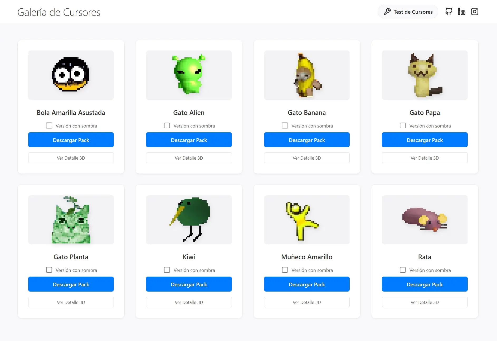

# 🖱️ Museo de Cursores

¡Bienvenido a mi colección personal de cursores! 

Esta página es una galería interactiva diseñada para explorar, probar y descargar una variedad de cursores personalizados para darle un toque único a tu equipo.

## ✨ Características

*   **Galería Visual:** Explora diferentes packs de cursores, desde diseños minimalistas hasta personajes animados.
*   **Vista Previa Real:** Los cursores se aplican en la web para que puedas "sentirlos" antes de descargarlos.
*   **Zona de Pruebas:** Una sección dedicada para probar cómo interactúan los cursores con diferentes elementos del sistema.
*   **Descarga Directa:** Obtén tus favoritos con un solo clic.

## 📂 Colecciones Incluidas

*   **My Cursors:** Mi selección personal favorita.
*   **Caritas:** Cursores divertidos y expresivos.
*   **Kirby 2020:** Un set temático del adorable personaje rosa.
*   **Otros:** Variedades extrañas y geniales.

## 🚀 Cómo usar

1.  Navega por la galería en la página principal.
2.  Pasa el mouse sobre las tarjetas para ver el cursor en acción.
3.  Haz clic en **"Descargar"** para obtener el archivo `.cur` o `.ani`.
4.  ¡Instálalo en tu configuración de mouse de Windows y disfruta!

---

Hecho con ❤️ por [Emanuel Lopez](https://github.com/ema28pro)
